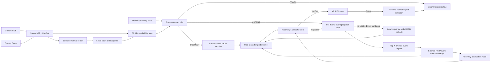

# Event-Guided RGB Recovery Design

## Goal

Preserve the existing shared ViT+Hopfield encoder and all normal-scene expert paths exactly, while replacing the always-on heavy SRBT recovery path with:

1. an always-on lightweight visibility gate;
2. an Event-guided recovery expert activated only after tracking becomes untrusted;
3. RGB clean-template verification before any recovered box is accepted.

The final system must improve FELT disappearance/reappearance tracking without reducing the existing general, motion, small-target, or discrimination expert capability.

## Fixed Constraints

- Each visible sample still uses only its selected normal expert.
- Normal expert architecture, weights, fusion, prediction head, and TRACK output remain unchanged.
- Recovery parameters are independent from normal expert parameters.
- Recovery training freezes the shared encoder and all normal experts.
- Gate inputs derived from normal expert outputs are detached before gate loss computation.
- No unavailable challenge annotation is required. Official frame boxes and present/absent data may be used for training and validation labels only.
- Validation and Test are causal and never receive ground-truth absent or challenge labels as model inputs.
- Final FELT claims use only the designated official toolkit.

## Architecture

## Module 1: SRBT-Lite Visibility Gate

The gate replaces the heavy per-frame SRBT observation, hazard, field, hypothesis, and future-teacher path. It predicts only whether the current local result is trustworthy.

Inputs:

- pooled shared RGBE feature;
- local response peak and response entropy;
- RGB/Event feature agreement;
- local box displacement and scale change supplied by the tracker;
- previous controller state.

Outputs:

- present probability;
- uncertainty probability.

The neural gate is a small projection/MLP. The controller owns temporal hysteresis; the gate does not predict time-to-reappearance. Under TRACK, its result cannot alter the expert bbox. Gate training detaches all encoder and expert-derived inputs.

## Module 2: Four-State Controller

- `TRACK`: emit the original expert bbox and permit THOR writes only when stable.
- `SUSPECT`: retain the local search for a short confirmation window, freeze THOR writes, and preserve the last clean template.
- `ABSENT`: emit `absent=true`, keep the last trusted box only as state, and activate global Event proposals every frame. Recovery is not delayed by disappearance duration.
- `VERIFY`: track a recovery candidate without writing memory. Resume TRACK only after repeated RGB identity and localization agreement.

Two consecutive untrusted frames enter SUSPECT; two additional untrusted frames enter ABSENT. A recovery candidate requires two consecutive confirmations. These values remain configuration knobs because event sensors and frame rates vary.

## Module 3: Event Proposal Map

The Event branch answers only "where did new motion appear?" It does not decide identity.

For each absent frame:

1. compute full-frame event activity from the supplied event representation;
2. subtract a slowly updated background activity estimate;
3. robustly normalize activity using median/MAD statistics;
4. extract spatially diverse Top-K peaks or connected regions;
5. expand each region to multi-scale candidate crops in original image coordinates.

The first implementation is deterministic and parameter-free. It is testable, adds no training instability, and can later be replaced by a learned proposal head only if proposal recall proves insufficient. The old Test call that passes `prior_H=None` is removed; the generated map becomes the real recovery prior.

## Module 4: RGB Clean-Template Verifier

The verifier answers only "is this the original target?"

- The positive template is the last clean RGB template snapshotted before SUSPECT/ABSENT.
- Candidate identity uses RGB features only; Event activity cannot satisfy identity by itself.
- Template and candidate embeddings are projected into a compact normalized identity space.
- Cosine similarity is calibrated with positive target crops and hard negative Event proposals from the same sequence.
- Verifier parameters are independent. Gradients do not enter the shared encoder or normal experts.

## Module 5: Recovery Localization and Arbitration

All Top-K candidate crops are processed in one batch. The existing redetection localization head initializes the recovery head where shapes match.

Each candidate receives:

- Event proposal strength;
- RGB identity similarity;
- localization response;
- cross-frame position/scale consistency.

Acceptance requires both an RGB identity threshold and a localization threshold; a high Event score alone can never recover the target. Accepted candidates enter VERIFY. The hypothesis tracker keeps multiple candidates until one remains stable.

If no usable Event proposal appears, a low-frequency full-frame RGB fallback runs. This covers stationary reappearance, weak events, and event-camera failure. Fallback frequency affects speed only in ABSENT state.

## Existing SRBT Disposition

The implementation replaces old behavior in place; it does not retain duplicate old and new paths.

| Existing component | Disposition |
| --- | --- |
| existence observation | replace with SRBT-Lite gate |
| semi-Markov hazard/time prediction | remove |
| always-on spatial field/candidate map | remove |
| future posterior teacher | remove |
| old duration-triggered global search | remove |
| THOR freeze/resume and clean snapshot | retain |
| hypothesis tracker | retain for recovery candidates |
| redetection localization weights | reuse as initialization |
| full-frame recovery fallback | retain at low frequency only |

## Training Strategy

### Stage A: Preserve Normal Experts

Use the best completed sparse-specialization checkpoint. Freeze the shared encoder, Hopfield memory, normal experts, router, and normal prediction head. Record hashes of frozen parameters before and after recovery training.

### Stage B: Train SRBT-Lite

Train only the gate using official present/absent labels. Use balanced sampling, focal/BCE presence loss, and hard negatives from low-response visible frames. Validate balanced accuracy, false-absent rate on continuously visible sequences, and transition latency.

### Stage C: Train Recovery Expert

Train the RGB verifier and recovery localization head on absent-to-present transitions. Positives are target crops at reappearance frames. Negatives are other high-activity Event regions in the same frame and temporally adjacent frames.

Losses:

- RGB identity contrastive/BCE loss;
- recovery score focal loss;
- bbox GIoU and L1 loss on positive proposals;
- candidate ranking loss that places the true target above Event hard negatives.

### Stage D: Train Router

Keep all experts and recovery modules frozen. Train the router on normal frame-derived challenge ownership. Recovery activation is controlled by SRBT-Lite, not by the normal expert router.

### Stage E: Calibrate Only

Calibrate gate, identity, localization, and confirmation thresholds on causal SequenceVal. Do not jointly update shared encoder or normal expert weights. This preserves normal expert capability by construction.

## Validation

All validation uses the Test tracker state machine and receives no ground-truth state input.

Required diagnostics:

- present/absent balanced accuracy;
- false-absent rate on continuously visible sequences;
- Event proposal Recall@1/3/5 on first reappearance frames;
- RGB verifier true-positive and false-accept rates;
- recovery latency in frames;
- IoU on the first 1, 3, and 5 visible frames after absence;
- normal-scene SR retention against the frozen expert checkpoint;
- TRACK FPS and ABSENT recovery FPS.

Final SR, PR, NPR, and attribute results use the official FELT toolkit only.

## Failure Handling

- No Event proposal: remain ABSENT and use the periodic RGB fallback.
- Global camera motion: robust activity normalization, spatial diversity, and mandatory RGB identity verification prevent Event-only acceptance.
- Reappearing target immediately becomes static: the initial Event burst is retained briefly; RGB fallback remains available.
- Multiple similar movers: maintain Top-K hypotheses and require cross-frame RGB identity consistency.
- Gate false negative: SUSPECT hysteresis prevents one-frame disappearance decisions.
- Gate false positive: normal expert output remains unchanged while TRACK is retained.

## Acceptance Criteria

- With the gate forced to TRACK, normal expert outputs match the pre-change model within numerical tolerance.
- Frozen shared and normal expert parameter hashes do not change during Stages B-E.
- Event proposal Recall@5 on reappearance frames is measured before verifier training; recovery training does not proceed if proposals cannot cover the target.
- Normal visible-sequence official metrics do not regress beyond measurement noise.
- Reappearance metrics improve at two consecutive validation checkpoints before Test inference.
- No new module is kept if it does not improve its directly assigned diagnostic.
