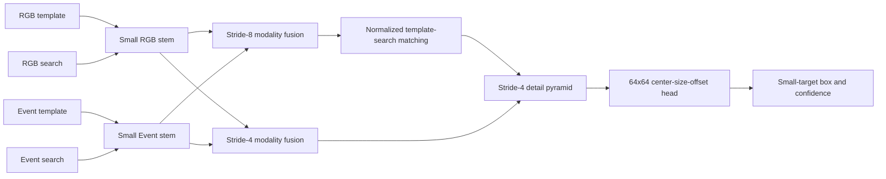

# Independent Lightweight Small-Target Expert Design

## Goal

Replace the current small-target adapter with a fully independent, lightweight RGB-event Siamese tracker. Both template and search observations bypass the shared AMTTrack ViT and Hopfield memory. The immutable generalist and the other specialists remain unchanged.

The hard acceptance requirement remains fixed: test-aligned SequenceVal `small_target_st` owner-frame mean IoU must reach at least `0.60`. Final FELT claims still use only the designated official MATLAB toolkit.

## Evidence

- Epoch-9 local-policy validation raised target-center crop coverage from `59.214%` to `98.526%`, but small-target IoU reached only `0.188403`.
- Of 407 owner-2 frames, 188 were in-window low-confidence failures and 149 were localization failures; only 64 were successful.
- Training crops presented targets near `68x81` pixels and reached roughly `0.70` train IoU, while causal validation targets averaged about `34x31` pixels.
- The current detail path still reuses the shared ViT patch projection and consumes shared backbone tokens. Its independent fusion adapter and head therefore cannot recover information already lost by the shared encoder.

## Chosen Architecture

### Independent Encoder Boundary

The small-target expert owns its RGB stem, event stem, modality fusion, template-search matching, feature pyramid, and prediction head. It does not call the shared ViT, Hopfield memory, shared expert fusion bank, or baseline box head.

Template and search use the same small-expert encoder weights in Siamese form. This is weight sharing inside one expert, not sharing with AMTTrack or another expert.

### Lightweight Feature Encoder

- Separate RGB and event convolutional stems preserve modality-specific evidence.
- Depthwise-separable residual blocks produce stride-4 and stride-8 features.
- Learned bounded gates fuse RGB texture and event motion at each scale.
- No full transformer stack, global redetection branch, or Hopfield layer is added.
- Initial engineering budget: at most `6M` trainable parameters and at most `20%` of one shared-ViT forward's measured latency. These are measured gates, not estimated claims.

### Template-Search Matching

L2-normalized template features produce a lightweight correlation response over stride-8 search features. Event features modulate, but do not replace, RGB identity evidence. A shallow top-down path combines the correlation response with stride-4 search detail before localization.

The prediction head emits center confidence, size, and offset on a native `64x64` grid for a `256x256` search crop. Decoding uses effective stride 4; no response map is downsampled before decoding.

## Execution Flow

### Specialist Training

An owner-2 batch dispatches directly to the independent small-target network before shared-backbone execution. Only the small-target network runs and receives gradients. The generalist, shared ViT, Hopfield memory, and all non-owner experts are absent from the optimizer and forward graph.

### Final Inference

The shared AMTTrack path runs once for the four non-small experts. The lightweight small-target path runs once in parallel from the raw RGB-event template and search crops. It contributes one box and one calibrated confidence to the existing single-candidate decision contract; boxes are never averaged.

If small-target evidence is insufficient, the output remains the exact generalist candidate. The independent path must not modify shared tracker state until its candidate is accepted.

## Initialization And Training Data

- Where tensor shapes permit, initialize the small stems from resized copies of the epoch-98 patch projection; copied parameters become independent immediately.
- Initialize the new prediction head from compatible epoch-98 head convolutions; initialize unmatched layers normally.
- Do not load the previous adapter-only small-target checkpoint into the new architecture.
- Sample owner-2 training targets around the causal validation scale, centered near `34x31` search pixels rather than `68x81`.
- Include controlled previous-state offsets so training reproduces non-centered causal search crops while retaining the target in-frame.
- Keep RGB-event geometric augmentation synchronized and preserve event sparsity statistics.

Training starts from a fresh isolated run. SequenceVal runs every epoch. Two consecutive complete validation points without meaningful improvement trigger diagnosis before any further architecture change.

## Checkpoint Contract

The checkpoint stores the independent small-target network under one dedicated namespace. Loading remains strict. The epoch-98 generalist parameters must remain byte-identical through small-target training. Best selection uses `ExpertVal/small_target_st_iou`; a checkpoint is not accepted below `0.60`.

## Verification

The smallest required checks are:

1. Owner-2 training does not execute the shared backbone and changes only small-target parameters.
2. Template and search both use the independent RGB/event encoder.
3. Non-owner training and inference outputs are unchanged when the small network is disabled.
4. The prediction grid is `64x64` and decoding uses stride 4.
5. Parameter and measured latency budgets pass on the server environment.
6. Causal diagnostics report crop coverage, low-confidence failures, localization failures, and small-target IoU.
7. Strict checkpoint save/resume reproduces the same output.

## Acceptance

- `ExpertVal/small_target_st_iou >= 0.60` on the fixed test-aligned SequenceVal split.
- Small-target IoU is no lower than the same-frame generalist IoU.
- Generalist parameters and outputs remain unchanged by specialist training.
- Small-target parameters are at most `6M` and measured extra latency is at most `20%` of one shared-ViT forward.
- No owner-2 batch executes the shared ViT or Hopfield path.
- Final FELT evaluation uses only the required official toolkit.

## Non-Goals

- No redesign of the other four experts.
- No learned router.
- No box averaging.
- No new dependency or generic backbone framework.
- No server document upload.
